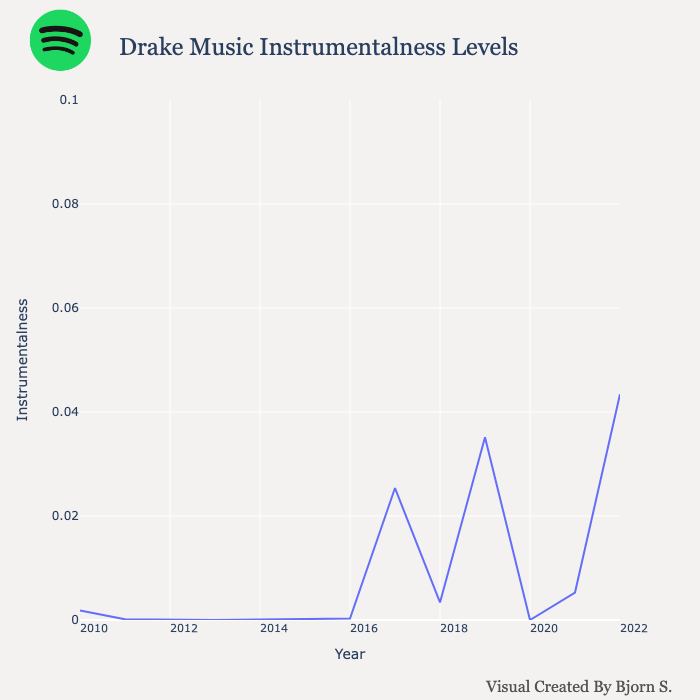

# Analyzing Drake's Discography 📊🚀
Bjorn S. | June 9, 2023

:max_bytes(150000):strip_icc():focal(959x305:961x307)/drake-annouces-tour-031423-c2f3a04d41bc41048f91dda62543b072.jpg)

## Introduction

A 5-time Grammy Awards winner, 29-time Billboard Music Award winner, 2021's Favorite Rap/Hip-Hop Male Artist and pop culture superstar.

But his most impressive accolade? The 2010's Artist of the Decade.

Aubrey Graham, otherwise known as "Drake", has a legendary career in the music industry spanning over 17 years.

The Canadaian rapper began his incredible run after his start in TV. Appearing in *Degrassi* (2001-2015), Drake played the character Jimmy.


As a Drake fan, I've listened to his music for over a decade. His ability to stay relevant in the ever-competitive music industry speaks to his talent to keep his followers entertained.

This data project was inspired by Spotify's annual Unwrapped project. Unwrapped has been a well received concept from Spotify that aims at unveiling juicy insights from their user data every year without being too intrusive. 

I must admit that last year was an extreme for my Drake fix, proven by one of the stories Spotify Unwrapped showed me:


#### I know. That's an **insane number**.

 I'd consider this pretty impressive, considering that of his over 70 million monthly followers on Spotify, only around 42,000 people listen to Drake more than me!

11,380 minutes roughly translates to 190 hours of streaming. You can typically find me with AirPods in, but especially in 2022 with all the new music he put out.


This translates to around ~4 hours of streaming a day 😮

Take what you will from that information!

## Data

To collect the data, I utilized Spotify's Web API. You first have to create an app in order to authorize your requests to the API as well as obtaining an access token. If you'd like to peform analysis for other artists, check their documentation [here](https://developer.spotify.com/documentation/web-api).

Some of the final dataset had to be preprocessed/feature engineered. While the Web API provides most of the core features, I had to do some further cleansing. Date variables, track length, artists on tracks are just some that I had to play around with to get it ready for analysis. To check out the entire data wrangling process as well as the code to create the charts for this, see the Python notebook in the repo.

**NOTICE:** 

* Spotify's API does not provide the number of streams for a given track, so I had to manually enter the number of streams for all songs on Drake albums through the Spotify app. It was time consuming but I did not have any other alternative. Spotify on web browser also hides this data so my attempt at web-scraping was unsuccessful. The values for the ```Plays``` variable was entered on **April 26th, 2023**. This snapshot of how many times each song has been streamed is no longer accurate.


* I removed the album **Nothing Was The Same (2013)** since the deluxe contained all of the original songs. Keeping the original album would have been redundant.

* Fans might argue that **Dark Lane Demo Tapes (2020)** was not an album, but rather a mixtape of individual songs packaged into a collection. I decided to keep the 'album'. Stringing to the same tune, **Care Package (2019)** is also not considered a true album as it's a compilation of songs between 2010-2016. I decided to keep this.


Lets dig in!

## Analysis (Popularity)

```
data.head()
```


More features are not shown in this snapshot. Drake's album discography contains 14 albums, 243 songs with the final dataset containing 31 features - 

```

data.info()

Data columns (total 31 columns):
 #   Column                    Non-Null Count  Dtype  
---  ------                    --------------  -----  
 0   Album                     243 non-null    object 
 1   Release Date              243 non-null    object 
 2   Release Year              243 non-null    int64  
 3   Release Month             243 non-null    int64  
 4   Release Month (Name)      243 non-null    object 
 5   Release Day               243 non-null    int64  
 6   Release Day (Name)        243 non-null    object 
 7   Album ID                  243 non-null    object 
 8   Number of Album Songs     243 non-null    int64  
 9   Song Name                 243 non-null    object 
 10  Plays                     243 non-null    int64  
 11  Artist                    243 non-null    object 
 12  Song ID                   243 non-null    object 
 13  Track Duration            243 non-null    object 
 14  Track Duration (Minutes)  243 non-null    int64  
 15  Track Duration (Seconds)  243 non-null    int64  
 16  Track Number              243 non-null    int64  
 17  Number of Artists         243 non-null    int64  
 18  Danceability              243 non-null    float64
 19  Energy                    243 non-null    float64
 20  Key                       243 non-null    int64  
 21  Loudness                  243 non-null    float64
 22  Speechiness               243 non-null    float64
 23  Acousticness              243 non-null    float64
 24  Instrumentalness          243 non-null    float64
 25  Liveness                  243 non-null    float64
 26  Valence                   243 non-null    float64
 27  Tempo                     243 non-null    float64
 28  Artist 1                  243 non-null    object 
 29  Artist 2                  95 non-null     object 
 30  Artist 3                  19 non-null     object 
dtypes: float64(9), int64(10), object(12)

```

Summary Statistics - 

```
data.describe()
```


Now that the data has been introduced, let's investigate some questions regarding his catalog.


### How Are Album's Ranked?


Not surprising to see Scorpion and Views taking the top 2 most popular Drake albums. Some of his most popular tracks appear in these albums, from *God's Plan, In My Feelings, One Dance and Hotline Bling*. Do you remember where you were when these songs released? 

[](https://www.youtube.com/watch?v=xpVfcZ0ZcFM&source_ve_path=MTc4NDI0&ab_channel=DrakeVEVO)


Part of the reason why Drake has sustained mainstream status in the music industry is thanks to catchy, iconic hits like these songs. Whether by lyrics, memes, or music videos, his relatability to the pop culture scene is uncanny. Staying relevant for this long is no easy feat, as most have just a few hits before vanishing from mainstream music.

However, it's worthy to note some of his worst peforming albums. His most recent albums, Her Loss and Honestly, Nevermind just released last year. It would be immature to take this graph at face value without understanding context. Give these albums time. Especially Her Loss, which is without a doubt been given positive feedback by most of his audience.

<iframe style="border-radius:12px" src="https://open.spotify.com/embed/album/5MS3MvWHJ3lOZPLiMxzOU6?utm_source=generator" width="100%" height="152" frameBorder="0" allowfullscreen="" allow="autoplay; clipboard-write; encrypted-media; fullscreen; picture-in-picture" loading="lazy"></iframe>


Speaking of popularity, what are his most popular songs?

### Top Tracks


At first glance, I'm actually surprised One Dance is his most popular song. I thought it would be God's Plan because of how it exploded across streaming sites in addition to it's music video that was released.

It's also interesting that the majority of songs in this list are either released as a Single or EP (extended play). To my knowledge, God's Plan (Scary Hours), One Dance, Hotline Bling, and Toosie Slide are considered a Single/EP. It's almost as if Drake knew these tracks would be a hit!

Unfortunately, I couldn't seem to have the chart color-coded without having it grouped by album in Plotly. Regardless, here it is:


As expected, his most popular tracks are also featured in his most popular albums. Toosie Slide is the exception, as this was a single that took the music industry by storm with the catchy, Tik-Tok friendly track. During lockdown, Drake delivered with a fun, danceable track. He also produced a music video, showcasing his _ridiculuously_ beautiful $100 million Canadian home estate. Check it out below!


[](https://www.youtube.com/watch?v=xWggTb45brM&ab_channel=DrakeVEVO)

Here's the list with his most popular song on each album:

```
q3 = pysqldf("SELECT Album, [Song Name], MAX(Plays) AS Streams 
                FROM data
                GROUP BY Album 
                ORDER BY MAX(Plays) DESC"
            )
```


## Analysis (Artists)

Artists such as Travis Scott, Kanye West, 21 Savage, and Rihanna have appeared on Aubrey's discography. Featuring other artists on albums can prove effective in joining fanbases, providing an alternative sound to the album, and increase hype. Personally, I try to listen to songs with features first before exploring solos whenever Drake drops an album. They tend to be the most listened to.

How does Drake split between solo and collaboration tracks?

### Does Drake Prefer Solo or Collaborations?


Interesting! Drake tends to feature on artists on his album's songs, with a generous 40% of his songs having others. Compared to another musician such as J. Cole, his likeness was built off albums that featured his voice and  his voice only. His most popular album, *Forest Hills Drive (2014)* went platinum with no features!


Looking at this from another angle, the total streams by song type looks nearly identical.

But let's get more granular than this. Let's see how streams perform for each of his albums.

### Album Average Streams


Across his 14 albums, 8 have a higher number of streams for collaboration tracks than solo's. *Honestly, Nevermind and Views* far exceed average streams for collaboration tracks. This is because *Jimmy Cooks* from *Honestly, Nevermind* and *One Dance* from *Views* were absolute hits from these respective albums. 

*Jimmy Cooks* is actually the only track featuring another artist (21 Savage) on *Honestly, Nevermind*.

Further analysis would be to normalize this data by the number of solos and collab songs. Speaking of artists such as 21 Savage, let's examine what artists Drake likes to feature in his songs:

### Featured Artists

```
q7_query = '''WITH CTE AS (
    SELECT [Artist 2] AS artist
    FROM data
    UNION  ALL
    SELECT [Artist 3] AS artist
    FROM data
    )
    SELECT artist, [Number of Features]
    FROM (
        SELECT artist, COUNT(*) AS [Number of Features], ROW_NUMBER() OVER(ORDER BY COUNT(*) DESC) AS rn
        FROM CTE
        GROUP BY artist
    ) subq
    WHERE rn > 1
    ORDER BY [Number of Features] DESC'''

q7 = pysqldf(q7_query)

q7
```


Future and 21 Savage skew the data given that *What A Time To Be Alive (2015)* and *Her Loss (2022)* are collaboration albums between Drake and the respective rapper.

 As Drake was coming onto the scene during the late 2000's, Lil Wayne is often labeled as Drake's mentor. 


Drake said in *What's Next*: 
<iframe style="border-radius:12px" src="https://open.spotify.com/embed/track/3aQem4jVGdhtg116TmJnHz?utm_source=generator" width="100%" height="152" frameBorder="0" allowfullscreen="" allow="autoplay; clipboard-write; encrypted-media; fullscreen; picture-in-picture" loading="lazy"></iframe>

```"I'm movin' way too humble

Weezy had handed it off, I still got no fumbles"
```

Lil Wayne's end to his run in the rap scene concluded with the passing of the torch to hungry, humble Drake who was otherwise only known for his appearances in *Degrassi*.

I was surprised that Kanye and The Weeknd only has one song together with Drake, but PARTYNEXTDOOR has 4? What happened to him?

Let's see the top 10 Drake songs that featured another artist:

### Featured Artists Ranking


This graph is misleading.

 Sure, Rihanna and Drake on a track is pop culture's dream, but Majid Jordan being Drake's second most popular featured artist by average streams? Nope. I call BS.

Turns out I was right! The reason why Majid Jordan is at #2 is because he is only featured on 2 songs with Drake. If the track is a hit, then this inflates the artist up the rankings. I can recall that one of the 2 tracks featuring Rihanna is Too Good from Views, which was one of the top tracks from the album. I could have set some arbitrary cutoff for this graph, but what I'd rather show from this visualization is the idea that data can be deceptive, and tuned to the author's narrative.

Nonetheless, it was cool to see 2 Chainz up there, along with Nicki Minaj, both of which I'm a follower of their music.

## Analysis (Audio)
Let's now take a look at the audio feature data that Spotify offers as part of the their API. We're interested in seeing if there's any trends or changes to Drake's musical style. Artsits typically adapt in their career to stay fresh in the industry, and Spotify offers some audio features that might help us with this question.

The variables in question are -

**Energy**: A measure from 0.0 to 1.0 and represents a perceptual measure of intensity and activity. Typically, energetic tracks feel fast, loud, and noisy. For example, death metal has high energy, while a Bach prelude scores low on the scale. Perceptual features contributing to this attribute include dynamic range, perceived loudness, timbre, onset rate, and general entropy.


**Acousticness**: A confidence measure from 0.0 to 1.0 of whether the track is acoustic. 1.0 represents high confidence the track is acoustic.

**Danceability**: Danceability describes how suitable a track is for dancing based on a combination of musical elements including tempo, rhythm stability, beat strength, and overall regularity. A value of 0.0 is least danceable and 1.0 is most danceable.

**Instrumentalness**: Predicts whether a track contains no vocals. "Ooh" and "aah" sounds are treated as instrumental in this context. Rap or spoken word tracks are clearly "vocal". The closer the instrumentalness value is to 1.0, the greater likelihood the track contains no vocal content. Values above 0.5 are intended to represent instrumental tracks, but confidence is higher as the value approaches 1.0.

**Loudness**: The overall loudness of a track in decibels (dB). Loudness values are averaged across the entire track and are useful for comparing relative loudness of tracks. Loudness is the quality of a sound that is the primary psychological correlate of physical strength (amplitude). Values typically range between -60 and 0 db.

**Tempo**: The overall estimated tempo of a track in beats per minute (BPM). In musical terminology, tempo is the speed or pace of a given piece and derives directly from the average beat duration.

**Valence**: A measure from 0.0 to 1.0 describing the musical positiveness conveyed by a track. Tracks with high valence sound more positive (e.g. happy, cheerful, euphoric), while tracks with low valence sound more negative (e.g. sad, depressed, angry).


Check out the full list of different audio features Spotify provides [here.](https://developer.spotify.com/documentation/web-api/reference/get-several-audio-features)

**NOTE**: Drake did not release an album in 2012 and 2014.

### Energy Over Time
**Energy**: A measure from 0.0 to 1.0 and represents a perceptual measure of intensity and activity. Typically, energetic tracks feel fast, loud, and noisy. For example, death metal has high energy, while a Bach prelude scores low on the scale. Perceptual features contributing to this attribute include dynamic range, perceived loudness, timbre, onset rate, and general entropy.


Not much change during his career, hovering near the average or slightly above average in energy levels.

## Acousticness Over Time
**Acousticness**: A confidence measure from 0.0 to 1.0 of whether the track is acoustic. 1.0 represents high confidence the track is acoustic.


More variance than Energy, although the ranges are just between 0.1 and 0.4.

## Danceability Over Time
**Danceability**: Danceability describes how suitable a track is for dancing based on a combination of musical elements including tempo, rhythm stability, beat strength, and overall regularity. A value of 0.0 is least danceable and 1.0 is most danceable.


The first audio feature to have a noticeable trend during his career. People love music that is danceable, so it's not surprising to see that his style adapts to what listeners want.

### Instrumentalness Over Time
**Instrumentalness**: Predicts whether a track contains no vocals. "Ooh" and "aah" sounds are treated as instrumental in this context. Rap or spoken word tracks are clearly "vocal". The closer the instrumentalness value is to 1.0, the greater likelihood the track contains no vocal content. Values above 0.5 are intended to represent instrumental tracks, but confidence is higher as the value approaches 1.0.



Keeping in mind that the range of values this audio feature takes is 0 - 1,  the scale used in this graph reveals his music focuses on vocals.

Young Drake started out extremely lyrical, as his songs created emotional connection through his storytelling and pain. However, as part of the album trilogy of *Certified Lover Boy (2021)*, *Honestly Nevermind (2022)*, and *Her Loss (2022)*, *Honestly Nevermind (2022)* was a highly instrumental album, a stark contrast to what Drake fan's are use to hearing from Aubrey. Although different from the norm, it's also one of his worst performing albums in total streams.

### Loudness Over Time

**Loudness**: The overall loudness of a track in decibels (dB). Loudness values are averaged across the entire track and are useful for comparing relative loudness of tracks. Loudness is the quality of a sound that is the primary psychological correlate of physical strength (amplitude). Values typically range between -60 and 0 db.


Not much variance over the years, levels hovering near the lower end of the range.

### Tempo Over Time
**Tempo**: The overall estimated tempo of a track in beats per minute (BPM). In musical terminology, tempo is the speed or pace of a given piece and derives directly from the average beat duration.


As usual, his music hasn't changed much in audio features. A few of his tracks are hype songs which feature an aggressive, uptempo beat but you can also hear tracks that offer a shallow, melancholy beat. His range is something that most artists can't replicate, and Drake has entertained fans with a variety of flows that appeal to the masses.

### Valence Over Time
**Valence**: A measure from 0.0 to 1.0 describing the musical positiveness conveyed by a track. Tracks with high valence sound more positive (e.g. happy, cheerful, euphoric), while tracks with low valence sound more negative (e.g. sad, depressed, angry).


With values favoring the lower end of the range, his discography steers towards being more negative. This isn't surpising however, as Drake is known for talking about topics such as misogyny, revenge, and heartbreak. Despite all of this negativity, he also has his fair share of motivating, hyped, "lover boy" tracks. He can do it all!

## Correlation Heatmap
In anticipation for the future of this project, I graphed the correlation matrix. We're primarily interested in scores between feature variables and ```Plays``` - 


Most features showed weak correlation scores except 2: ```Danceability``` and ```Number of Album Songs```. ```Danceability``` is self-explanatory, but ```Number of Album Songs``` was surprising.

## Final Thoughts | Next Steps

Whether you're a fan of him or his music, you can't deny the his presence in pop culture among Millenials and Gen-Z. At 35, his music career may be coming to an end, but one can argue that he's cemented his spot in history as one of the most catchy artists to ever step into the studio.

As for next steps of this project, I planned on developing personalized playlists for my Spotify account based on different Drake "moods". This would be achieved by using an unsupervised ML algorithm, KMeans clustering to group similar tracks together based on a given value of K. I then planned on using Spotify's API to create playlists based on the the clustering recommendation output.


If you've read this far, I appreciate your time!

